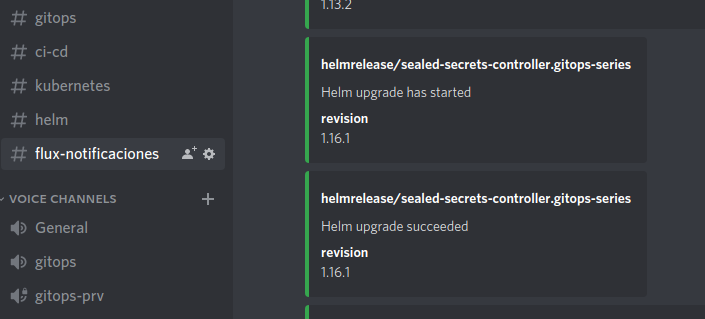
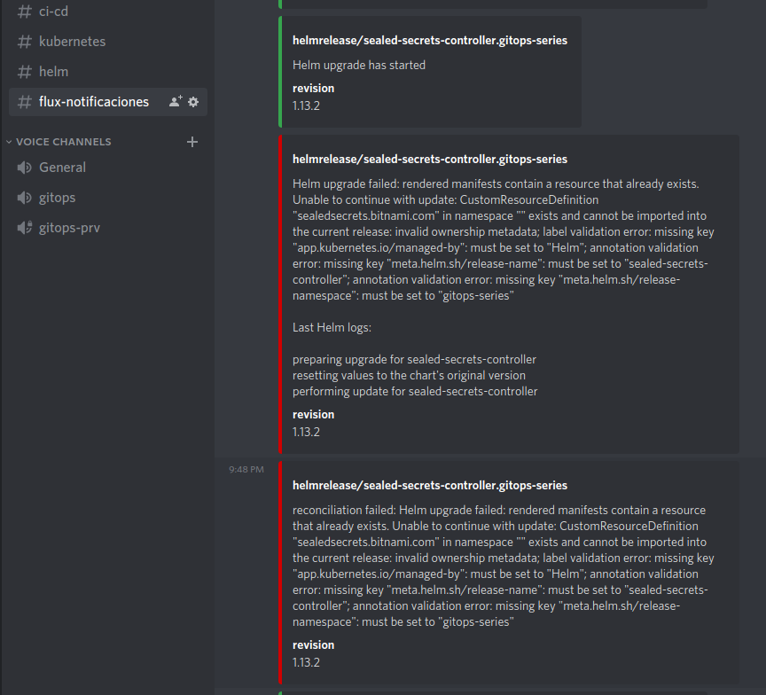
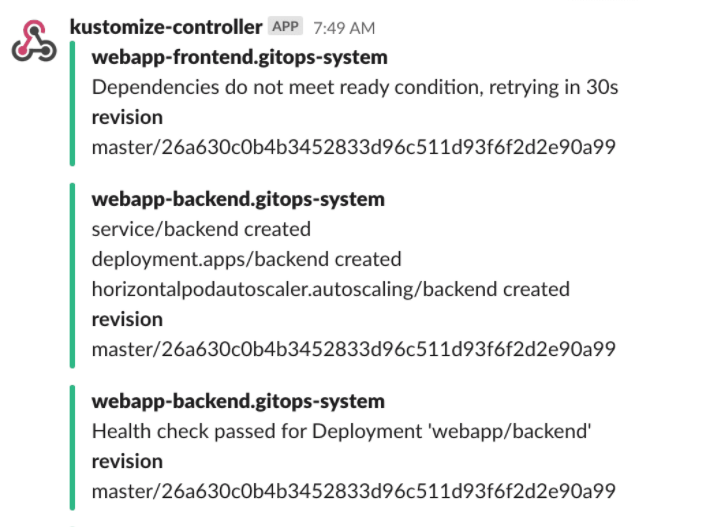

# 7.1 Notificaciones

Durante la guía se realizarán las configuraciones necesarias para habilitar las notificaciones de Flux y se explorarán distintas formas de utilizarlas para brindar visibilidad durante los despliegues del estado del cluster.

Flux permite enviar alertas a las siguientes plataformas y servicios: *Google Chat, Microsoft Teams, Discord, Slack, Rocket, Webhook genérico, Webex, Sentry, Azure Event Hub*.

Los pasos que se seguirán durante la guía son los siguientes:

1. Desplegar el servicio [gitops-webhook](https://github.com/sngular/gitops-webhook).

   Servicio que permitirá observar las alertas en caso de no disponer de alguno de los proveedores descritos arriba.

2. Configurar un proveedor de notificaciones.
3. Configurar las alertas que se desean recibir.
4. Desplegar la aplicación [echobot](https://github.com/sngular/gitops-echobot).
5. Comprobar el funcionamiento de las alertas.
6. Mostrar alertas de error al intentar actualizar la aplicación [echobot](https://github.com/sngular/gitops-echobot).

Vídeo de la explicación y la demo completa en este [vídeo](https://www.youtube.com/watch?v=Xm-FMVHJySY&list=PLuQL-CB_D1E7gRzUGlchvvmGDF1rIiWkj&index=8).

## Requisitos

* Acceso para administrar un cluster de Kubernetes >=v1.19
* Tener instalado cliente Flux >=0.16.0 - [instrucciones](../2.1-instalacion-flux/readme#instalación-del-binario-flux)

## Exportar token de GitHub

```bash
export GITHUB_TOKEN=<your-token>
export GITHUB_USER=<your-username>
```

## Instalar Flux en el cluster

Utilice el comando `bootstrap` para instalar los componentes de flux en el cluster y crear el repositorio en GitHub:

```bash
flux bootstrap github \
  --owner=$GITHUB_USER \
  --repository=gitops-flux-series-demo \
  --branch=main \
  --private=false \
  --path=./clusters/demo
```
<details>
  <summary>Resultado</summary>

  ```bash
  ► connecting to github.com
  ► cloning branch "main" from Git repository "https://github.com/sngular/gitops-flux-series-demo.git"
  ✔ cloned repository
  ► generating component manifests
  ✔ generated component manifests
  ✔ component manifests are up to date
  ► installing toolkit.fluxcd.io CRDs
  ◎ waiting for CRDs to be reconciled
  ✔ CRDs reconciled successfully
  ► installing components in "flux-system" namespace
  ✔ installed components
  ✔ reconciled components
  ► determining if source secret "flux-system/flux-system" exists
  ► generating source secret
  ✔ public key: ssh-rsa AAAAB3NzaC1yc2EAAAADAQABAAABAQDSTrIKbYAWLUjcG7ec6lWJ2KACfF5YB5KqpQcN+LmxkSYmJbFPBmlzZdtIUEvZcAORJYeMKvk+iAcZC6rPn0OCBKp3ypOiMC5HnF5Lnn4XPt1+Nwx30mC72RzkheFm+K3Q0kTySAi8QdKy94aWqBVpTdZzkJ0woNHJg/aL3gQnofXueiczwkMvB2B6x4vgdbBgLOrRl7YhtGz0B6e9a7U4EEBoPdzjti/w7OAQnOpCZ80TwYcuFCioPE0q2i3BgKLvt0x9rBikzuOSgqKFfoAy3zPETgWZ0kPSbHby3lv+NfwWaLVULVpkpNQTwxBbMJVDcwKuyTUacSGeZcUzS2mB
  ✔ configured deploy key "flux-system-main-flux-system-./cluster/namespaces" for "https://github.com/sngular/gitops-flux-series-demo"
  ► applying source secret "flux-system/flux-system"
  ✔ reconciled source secret
  ► generating sync manifests
  ✔ generated sync manifests
  ✔ sync manifests are up to date
  ► applying sync manifests
  ✔ reconciled sync configuration
  ◎ waiting for Kustomization "flux-system/flux-system" to be reconciled
  ✔ Kustomization reconciled successfully
  ► confirming components are healthy
  ✔ source-controller: deployment ready
  ✔ kustomize-controller: deployment ready
  ✔ helm-controller: deployment ready
  ✔ notification-controller: deployment ready
  ✔ all components are healthy
  ```
</details>

Comprobar que el despliegue se ha realizado correctamente.

```bash
kubectl get pods --namespace flux-system
```

<details>
  <summary>Resultado</summary>

  ```
  NAME                                           READY   STATUS    RESTARTS   AGE
  helm-controller-85bfd4959d-bfvnf               1/1     Running   0          3m13s
  kustomize-controller-6977b8cdd4-xncbj          1/1     Running   0          3m13s
  source-controller-85fb864746-xhrvb             1/1     Running   0          3m12s
  notification-controller-5c4d48f476-28g7q       1/1     Running   0          3m13s
  ```
</details>

## Clonar repositorio creado

Clonar el repositorio que Flux está sincronizando con el cluster.

```bash
{
  git clone git@github.com:$GITHUB_USER/gitops-flux-series-demo.git
  cd gitops-flux-series-demo
}
```

## Desplegar servicio de notificaciones

Se va a desplegar el servicio [gitops-webhook](https://github.com/sngular/gitops-webhook) que actuará como webhook genérico y recibirá las alertas enviadas por Flux.

Crear carpeta para almacenar las fuentes:

```bash
mkdir ./clusters/demo/sources/
```

Crear definición de HelmRepository para los [charts de Sngular](https://github.com/sngular/gitops-helmrepository):

```bash
flux create source helm sngular \
  --url=https://sngular.github.io/gitops-helmrepository/ \
  --interval=5m \
  --namespace=flux-system \
  --export > clusters/demo/sources/sngular-helmrepository.yaml
```

Crear carpeta para el sistema de notificaciones:

```bash
mkdir ./clusters/demo/notification-system/
```

Crear el namespace para las notificaciones:

```bash
cat <<EOF > ./clusters/demo/notification-system/namespace.yaml
apiVersion: v1
kind: Namespace
metadata:
  name: notification-system
EOF
```

Crear fichero HelmRelease para desplegar el servicio de notificaciones:

```bash
flux create helmrelease generic \
  --interval=1m \
  --source=HelmRepository/sngular.flux-system \
  --chart=webhook \
  --chart-version="0.1.0" \
  --namespace=notification-system \
  --export > clusters/demo/notification-system/generic-helmrelease.yaml
```

```bash
tree

.
└── clusters
    └── demo
        ├── flux-system
        │   ├── gotk-components.yaml
        │   ├── gotk-sync.yaml
        │   └── kustomization.yaml
        ├── notification-system
        │   ├── generic-helmrelease.yaml
        │   └── namespace.yaml
        └── sources
            └── sngular-helmrepository.yaml
```

Agregar cambios al repositorio:

```bash
{
  git add .
  git commit -m 'Deploy notification system'
  git push origin main
}
```

Utilice el siguiente comando para conocer cómo van sucediendo los cambios:

```bash
watch -n1 "flux get source chart --all-namespaces && echo \
&& flux get helmrelease --all-namespaces && echo \
&& kubectl get pods --namespace notification-system"
```

Acelerar el ciclo de reconciliación:

```bash
flux reconcile kustomization flux-system --with-source
```

Para comprobar que el servicio está funcionando correctamente se utilizara el siguiente comando:

```bash
kubectl port-forward \
  --namespace notification-system \
  svc/generic-webhook 8080:80 > /dev/null 2>&1 &
```

Ahora podrá consultar al siguiente enlace:

```bash
curl http://localhost:8080/all
```

<details>
  <summary>Resultado</summary>

  ```bash
  Total notifications: 0
  ```
</details>

## Crear proveedor de notificaciones

Crear carpeta y namespace `gitops-series`:

```bash
mkdir -p ./clusters/demo/gitops-series
```

```bash
cat <<EOF > ./clusters/demo/gitops-series/namespace.yaml
apiVersion: v1
kind: Namespace
metadata:
  name: gitops-series
EOF
```

El primer proveedor de notificaciones a crear enviará los mensajes al sistema desplegado en el namespace `notification-system`.

```bash
flux create alert-provider generic \
  --namespace gitops-series \
  --type generic \
  --address "http://generic-webhook.notification-system/webhook" \
  --export > ./clusters/demo/gitops-series/generic-provider.yaml
```

<details>
  <summary>Resultado</summary>

  ```yaml
  ---
  apiVersion: notification.toolkit.fluxcd.io/v1beta1
  kind: Provider
  metadata:
    name: generic
    namespace: gitops-series
  spec:
    address: http://generic-webhook.notification-system/webhook
    type: generic
  ```
</details>

Adicionar los cambios al repositorio:

```bash
{
  git add .
  git commit -m 'Add generic provider'
  git push origin main
}
```

```bash
flux get alert-providers --all-namespaces
```

<details>
  <summary>Resultado</summary>

  ```
  NAMESPACE       NAME    READY   MESSAGE
  gitops-series   generic True    Initialized
  ```
</details>

## Crear alertas

Crear una alerta que permita permita conocer cuando un objeto de flux se modifica:

```bash
flux create alert generic \
  --namespace gitops-series \
  --provider-ref generic \
  --event-severity info \
  --event-source "HelmRepository/*,HelmRelease/*" \
  --export > ./clusters/demo/gitops-series/generic-alerts.yaml
```

<details>
  <summary>Resultado</summary>

  ```yaml
  apiVersion: notification.toolkit.fluxcd.io/v1beta1
  kind: Alert
  metadata:
    name: generic
    namespace: gitops-series
  spec:
    eventSeverity: info
    eventSources:
    - kind: HelmRepository
      name: '*'
    - kind: HelmRelease
      name: '*'
    providerRef:
      name: generic
  ```
</details>

```bash
{
  git add .
  git commit -m 'Add alert crd'
  git push origin main
}
```

```bash
flux get alerts --all-namespaces
```

<details>
  <summary>Resultado</summary>

  ```
  NAMESPACE       NAME      READY   MESSAGE         SUSPENDED
  gitops-series   generic   True    Initialized     False
  ```
</details>

## Desplegar servicio echobot

Crear el fichero HelmRelease asociado al servicio [echobot](https://github.com/sngular/gitops-helmrepository/blob/main/charts/echobot/README.md):

```bash
flux create helmrelease echobot \
  --interval=1m \
  --source=HelmRepository/sngular.flux-system \
  --chart=echobot \
  --chart-version="0.3.4" \
  --namespace=gitops-series \
  --export > clusters/demo/gitops-series/echobot-helmrelease.yaml
```

Añadir los cambios en el repositorio:

```bash
{
  git add .
  git commit -m 'Deploy echobot service'
  git push origin main
}
```

Sincronizar la información sin esperar a al ciclo de reconciliación:

```bash
flux reconcile kustomization flux-system --with-source
```

Comprobar que han llegado las alertas al canal de Discord y al servicio `gitops-webhook`:

```bash
curl http://localhost:8080/all
```

Listar los pods del servicio desplegado:

```bash
kubectl get pods --namespace gitops-series
```

Si se desea eliminar las alertas utilizar el comando `curl http://localhost:8080/clear`.

## Eliminar un objetos con alertas

```bash
kubectl delete hr -n gitops-series echobot
```

Sincronizar la información sin esperar a al ciclo de reconciliación:

```bash
flux reconcile kustomization flux-system --with-source
```

Comprobar que han llegado las alertas al canal de Discord y al servicio `gitops-webhook`:

```bash
curl http://localhost:8080/all
```

Si se desea eliminar las alertas utilizar el comando `curl http://localhost:8080/clear`.

## (Opcional) Enviar alertas a Discord

Crear un secreto con el campo `address` para almacenar la url del webhook:

```bash
kubectl create secret generic discord-webhook-url \
  --namespace gitops-series \
  --from-literal="address=https://discord.com/api/webhooks/843196129700610088/XAgX4wPsIlyW8X4BVqkWcKotiI4gU12cgDw9ufjuNV_wXeLKATlXVilLKZXch6Jhubf6"
```

Crear el provider de Discord:

```bash
flux create alert-provider discord \
  --namespace gitops-series \
  --type discord \
  --channel flux-notificaciones \
  --username "Flux [demo-cluster]" \
  --secret-ref discord-webhook-url \
  --export > ./clusters/demo/gitops-series/discord-provider.yaml
```

<details>
  <summary>Resultado</summary>

  ```yaml
  ---
  apiVersion: notification.toolkit.fluxcd.io/v1beta1
  kind: Provider
  metadata:
    name: discord
    namespace: gitops-series
  spec:
    type: discord
    channel: flux-notificaciones
    secretRef:
      name: discord-webhook-url
    username: Flux [demo-cluster]
EOF
  ```
</details>

Configurar las alertas que serán enviadas a Discord

```bash
flux create alert discord \
  --namespace gitops-series \
  --provider-ref discord \
  --event-severity info \
  --event-source "HelmRelease/*" \
  --export > ./clusters/demo/gitops-series/discord-alerts.yaml
```

<details>
  <summary>Resultado</summary>

  ```bash
  ---
  apiVersion: notification.toolkit.fluxcd.io/v1beta1
  kind: Alert
  metadata:
    name: discord
    namespace: gitops-series
  spec:
    eventSeverity: info
    eventSources:
    - kind: Kustomization
      name: '*'
    - kind: GitRepository
      name: '*'
    - kind: HealmRepository
      name: '*'
    - kind: HelmRelease
      name: '*'
    providerRef:
      name: discord
  ```
</details>

Añadir los cambios en el repositorio:

```bash
{
  git add .
  git commit -m 'Add provider and alerts for discord'
  git push origin main
}
```

## (Opcional) Desintalar Flux

Si quieres desinstalar Flux puedes utilizar este comando:

```bash
flux uninstall --silent
```

> Compruebe que el repositorio en GitHub no ha sido eliminado.

<details>
  <summary>Resultado</summary>

  ```
  ► deleting components in flux-system namespace
  ✔ Deployment/flux-system/helm-controller deleted
  ✔ Deployment/flux-system/kustomize-controller deleted
  ✔ Deployment/flux-system/notification-controller deleted
  ✔ Deployment/flux-system/source-controller deleted
  ✔ Service/flux-system/notification-controller deleted
  ✔ Service/flux-system/source-controller deleted
  ✔ Service/flux-system/webhook-receiver deleted
  ✔ NetworkPolicy/flux-system/allow-egress deleted
  ✔ NetworkPolicy/flux-system/allow-scraping deleted
  ✔ NetworkPolicy/flux-system/allow-webhooks deleted
  ✔ ServiceAccount/flux-system/helm-controller deleted
  ✔ ServiceAccount/flux-system/kustomize-controller deleted
  ✔ ServiceAccount/flux-system/notification-controller deleted
  ✔ ServiceAccount/flux-system/source-controller deleted
  ✔ ClusterRole/crd-controller-flux-system deleted
  ✔ ClusterRoleBinding/cluster-reconciler-flux-system deleted
  ✔ ClusterRoleBinding/crd-controller-flux-system deleted
  ► deleting toolkit.fluxcd.io finalizers in all namespaces
  ✔ GitRepository/flux-system/flux-system finalizers deleted
  ✔ Kustomization/flux-system/flux-system finalizers deleted
  ► deleting toolkit.fluxcd.io custom resource definitions
  ✔ CustomResourceDefinition/alerts.notification.toolkit.fluxcd.io deleted
  ✔ CustomResourceDefinition/buckets.source.toolkit.fluxcd.io deleted
  ✔ CustomResourceDefinition/gitrepositories.source.toolkit.fluxcd.io deleted
  ✔ CustomResourceDefinition/helmcharts.source.toolkit.fluxcd.io deleted
  ✔ CustomResourceDefinition/helmreleases.helm.toolkit.fluxcd.io deleted
  ✔ CustomResourceDefinition/helmrepositories.source.toolkit.fluxcd.io deleted
  ✔ CustomResourceDefinition/kustomizations.kustomize.toolkit.fluxcd.io deleted
  ✔ CustomResourceDefinition/providers.notification.toolkit.fluxcd.io deleted
  ✔ CustomResourceDefinition/receivers.notification.toolkit.fluxcd.io deleted
  ✔ Namespace/flux-system deleted
  ✔ uninstall finished
  ```
</details>

## Ejemplos de algunos proveedores

- Discord

<details>
  <summary>Configuración</summary>

  ```yaml
  ---
  apiVersion: notification.toolkit.fluxcd.io/v1beta1
  kind: Provider
  metadata:
    name: discord
    namespace: gitops-series
  spec:
    channel: flux-notificaciones
    secretRef:
      name: discord-webhook-url
    type: discord
    username: Flux [demo-cluster]
  ```
  </details>





- Teams

<details>
  <summary>Configuración</summary>

  ```yaml
  ---
  apiVersion: notification.toolkit.fluxcd.io/v1beta1
  kind: Provider
  metadata:
    name: msteams
    namespace: gitops-series
  spec:
    type: msteams
    channel: flux-notificaciones
    address: https://ORGANIZATION.webhook.office.com/WEBHOOK
  ```
</details>


- Slack

<details>
  <summary>Configuración</summary>

  ```yaml
  ---
  apiVersion: notification.toolkit.fluxcd.io/v1beta1
  kind: Provider
  metadata:
    name: slack
    namespace: gitops-series
  spec:
    type: slack
    channel: flux-notificaciones
    address:  https://hooks.slack.com/services/YOUR/SLACK/WEBHOOK
  ```
</details>




