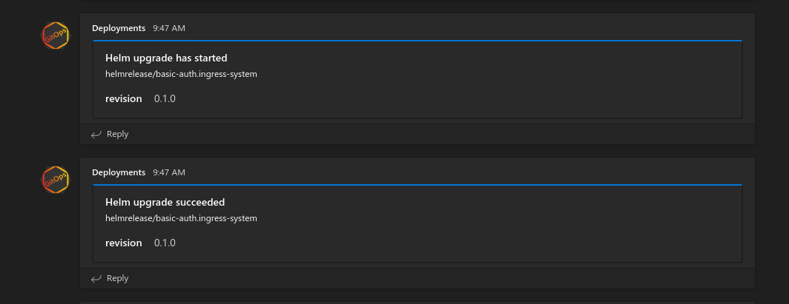
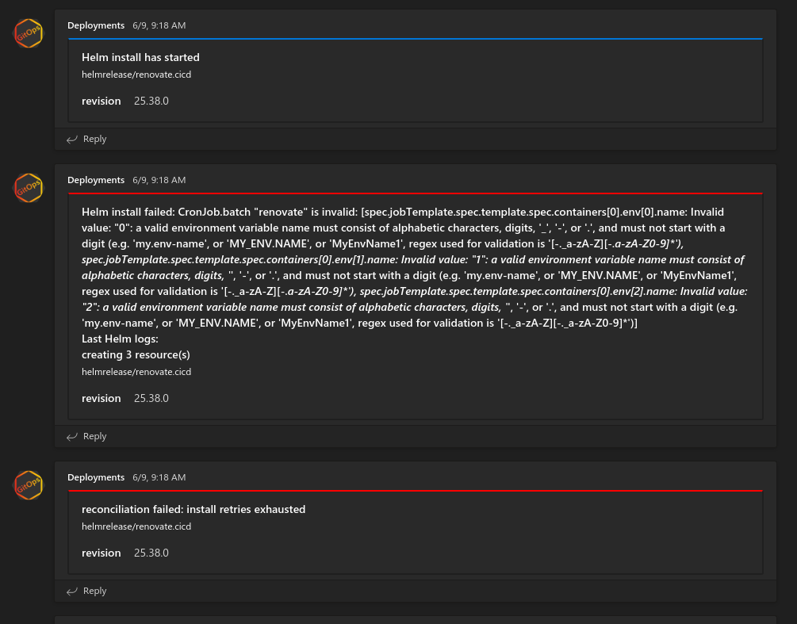

# 7.1 Notificaciones

TODO:
- [ ] crear secreto para webhook urls?
- [ ] despliegue del `gitops-webhook` con GitRepository o con HelmRelease?
- [ ] desplegar echobot con GitRepository o con HelmRelease?
- [ ] forzar despliegue fallido
- [ ] revisar configuración de alertas y la doc oficial para buscar novedades

Durante esta guía se realizarán las configuraciones necesarias para habilitar las notificaciones de Flux y se explorarán distintas formas de utilizarlas para proveer de visibilidad en los despliegues del cluster.

Flux soporta enviar alertas a canales de los siguientes servicios:

- Google Chat
- Microsoft Teams
- Discord
- Slack
- Rocket
- Webhook genérico

Los pasos que se seguirán durante la guía son los siguientes:

1. (Opcional) Desplegar el servicio `gitops-webhook` que permitirá observar las alertas recibidas en caso de que no se disponga de uno de los proveedores descritos arriba.
2. Configurar un proveedor de notificaciones soportado por Flux
3. Configurar las alertas que se desean recibir
4. Desplegar la aplicación `echobot` y comprobar las alertas.
5. Excluir algunas notificacones

Vídeo de la explicación y la demo completa en este [vídeo](https://www.youtube.com/watch?v=Xm-FMVHJySY&list=PLuQL-CB_D1E7gRzUGlchvvmGDF1rIiWkj&index=8).

## Requisitos

* Acceso para administrar un cluster de Kubernetes >=v1.19
* Tener instalado cliente Flux >=0.13.2 - [instrucciones](../2.1-instalacion-flux/readme#instalación-del-binario-flux)
* Disponer de un proveedor de notificaciones soportado por Flux.
* Disponer de una webhook url en el proveedor de notificaciones para recibir las alertas.

  * Microsoft Teams:
    * [Guía para crear un webhook](https://docs.microsoft.com/es-es/microsoftteams/platform/webhooks-and-connectors/how-to/add-incoming-webhook)
  * Discord:
    * [Guía para crear un servidor gratuito de Discord y un webhook](https://support.discord.com/hc/es/articles/204849977--C%C3%B3mo-creo-un-servidor-)
    * [Guía para crear un webhook](https://support.discord.com/hc/es/articles/228383668-Introducci%C3%B3n-a-los-webhook)
  * Slack:
    * [Crear cuenta y espacio de trabajo](https://slack.com/intl/es-es/create)
    * [Guía para crear un webhook](https://slack.com/intl/es-la/help/articles/115005265063-Webhooks-entrantes-para-Slack)

## Exportar token de GitHub

```bash
export GITHUB_TOKEN=<your-token>
export GITHUB_USER=<your-username>
```

## Instalar Flux en el cluster

Al comando de instalación habitual se ha añadido el flag `--components-extra` para incluir los controladores que nos ayudarán a automatizar el despliegue de imágenes.

```bash
flux bootstrap github \
  --owner=$GITHUB_USER \
  --repository=gitops-flux-series-demo \
  --branch=main \
  --private=false \
  --path=./cluster/namespaces \
```
<details>
  <summary>Resultado</summary>

  ```bash
  ► connecting to github.com
  ► cloning branch "main" from Git repository "https://github.com/sngular/gitops-flux-series-demo.git"
  ✔ cloned repository
  ► generating component manifests
  ✔ generated component manifests
  ✔ component manifests are up to date
  ► installing toolkit.fluxcd.io CRDs
  ◎ waiting for CRDs to be reconciled
  ✔ CRDs reconciled successfully
  ► installing components in "flux-system" namespace
  ✔ installed components
  ✔ reconciled components
  ► determining if source secret "flux-system/flux-system" exists
  ► generating source secret
  ✔ public key: ssh-rsa AAAAB3NzaC1yc2EAAAADAQABAAABAQDSTrIKbYAWLUjcG7ec6lWJ2KACfF5YB5KqpQcN+LmxkSYmJbFPBmlzZdtIUEvZcAORJYeMKvk+iAcZC6rPn0OCBKp3ypOiMC5HnF5Lnn4XPt1+Nwx30mC72RzkheFm+K3Q0kTySAi8QdKy94aWqBVpTdZzkJ0woNHJg/aL3gQnofXueiczwkMvB2B6x4vgdbBgLOrRl7YhtGz0B6e9a7U4EEBoPdzjti/w7OAQnOpCZ80TwYcuFCioPE0q2i3BgKLvt0x9rBikzuOSgqKFfoAy3zPETgWZ0kPSbHby3lv+NfwWaLVULVpkpNQTwxBbMJVDcwKuyTUacSGeZcUzS2mB
  ✔ configured deploy key "flux-system-main-flux-system-./cluster/namespaces" for "https://github.com/sngular/gitops-flux-series-demo"
  ► applying source secret "flux-system/flux-system"
  ✔ reconciled source secret
  ► generating sync manifests
  ✔ generated sync manifests
  ✔ sync manifests are up to date
  ► applying sync manifests
  ✔ reconciled sync configuration
  ◎ waiting for Kustomization "flux-system/flux-system" to be reconciled
  ✔ Kustomization reconciled successfully
  ► confirming components are healthy
  ✔ image-reflector-controller: deployment ready
  ✔ image-automation-controller: deployment ready
  ✔ source-controller: deployment ready
  ✔ kustomize-controller: deployment ready
  ✔ helm-controller: deployment ready
  ✔ notification-controller: deployment ready
  ✔ all components are healthy
  ```
</details>

Comprobar que el despliegue se ha realizado correctamente.

```bash
kubectl get pods --namespace flux-system
```

<details>
  <summary>Resultado</summary>

  ```
  NAME                                           READY   STATUS    RESTARTS   AGE
  helm-controller-85bfd4959d-bfvnf               1/1     Running   0          3m13s
  image-reflector-controller-55fb577bf9-kngjc    1/1     Running   0          3m13s
  image-automation-controller-776465b9b6-q5rz4   1/1     Running   0          3m13s
  kustomize-controller-6977b8cdd4-xncbj          1/1     Running   0          3m13s
  source-controller-85fb864746-xhrvb             1/1     Running   0          3m12s
  notification-controller-5c4d48f476-28g7q       1/1     Running   0          3m13s
  ```
</details>

## Clonar repositorio creado

Clonar el repositorio que Flux está sincronizando con el cluster. 

```bash
{
  git clone git@github.com:$GITHUB_USER/gitops-flux-series-demo.git
  cd gitops-flux-series-demo
}
```

## Crear proveedor de notificaciones

Es posible crear más de un proveedor si es necesario.

`mkdir -p ./cluster/namespaces/gitops-series`

1. `gitops-webhook`

```bash
flux create alert-provider gitops-webhook \
  --namespace gitops-series \
  --type generic \
  --address "https://webhook.gitops-series/webhook" \
  --export > ./cluster/namespaces/gitops-series/generic-provider.yaml
```

<details>
  <summary>Resultado</summary>

  ```bash
  ---
  apiVersion: notification.toolkit.fluxcd.io/v1beta1
  kind: Provider
  metadata:
    name: gitops-webhook
    namespace: gitops-series
  spec:
    address: https://webhook.gitops-series/webhook
    type: generic
  ```
</details>

2. Discord

```bash
flux create alert-provider discord \
  --namespace gitops-series \
  --type discord \
  --channel flux-notificaciones \
  --username "Flux [demo-cluster]" \
  --address "https://discord.com/api/webhooks/843196129700610088/XAgX4wPsIlyW8X4BVqkWcKotiI4gU12cgDw9ufjuNV_wXeLKATlXVilLKZXch6Jhubf6" \
  --export > ./cluster/namespaces/gitops-series/discord-provider.yaml
```

<details>
  <summary>Resultado</summary>

  ```bash
  ---
  apiVersion: notification.toolkit.fluxcd.io/v1beta1
  kind: Provider
  metadata:
    name: discord
    namespace: gitops-series
  spec:
    type: discord
    username: Flux [demo-cluster]
    channel: flux-notificaciones
    address: https://discord.com/api/webhooks/843196129700610088/XAgX4wPsIlyW8X4BVqkWcKotiI4gU12cgDw9ufjuNV_wXeLKATlXVilLKZXch6Jhubf6
EOF
  ```
</details>

```bash
flux get alert-providers --namespace gitops-series
```

<details>
  <summary>Resultado</summary>

  ```
  NAME            READY   MESSAGE
  discord         True    Initialized
  gitops-webhook  True    Initialized
  ```
</details>

## Crear alertas

1. `gitops-webhook`

```bash
flux create alert gitops-webhook-alerts \
  --namespace gitops-series \
  --provider-ref generic \
  --event-severity info \
  --event-source "Kustomization/*,GitRepository/*,HealmRepository/*,HelmRelease/*" \
  --export > ./cluster/namespaces/gitops-series/gitops-webhook-alerts.yaml
```

<details>
  <summary>Resultado</summary>

  ```bash
  ---
  apiVersion: notification.toolkit.fluxcd.io/v1beta1
  kind: Alert
  metadata:
    name: gitops-webhook-alerts
    namespace: gitops-series
  spec:
    eventSeverity: info
    eventSources:
    - kind: Kustomization
      name: '*'
    - kind: GitRepository
      name: '*'
    - kind: HealmRepository
      name: '*'
    - kind: HelmRelease
      name: '*'
    providerRef:
      name: gitops-webhook
  ```
</details>

2. Discord

```bash
flux create alert discord-alerts \
  --namespace gitops-series \
  --provider-ref discord \
  --event-severity info \
  --event-source "Kustomization/*,GitRepository/*,HealmRepository/*,HelmRelease/*" \
  --export > ./cluster/namespaces/gitops-series/discord-alerts.yaml
```

<details>
  <summary>Resultado</summary>

  ```bash
  ---
  apiVersion: notification.toolkit.fluxcd.io/v1beta1
  kind: Alert
  metadata:
    name: discord-alerts
    namespace: gitops-series
  spec:
    eventSeverity: info
    eventSources:
    - kind: Kustomization
      name: '*'
    - kind: GitRepository
      name: '*'
    - kind: HealmRepository
      name: '*'
    - kind: HelmRelease
      name: '*'
    providerRef:
      name: discord
  ```
</details>

```bash
flux get alerts --namespace gitops-series
```

<details>
  <summary>Resultado</summary>

  ```
  NAME                   READY   MESSAGE         SUSPENDED
  discord-alerts         True    Initialized     False
  gitops-webhook-alerts  True    Initialized     False
  ```
</details>

## Desplegar echobot

## Crear alertas con exclusiones

```bash
cat <<EOF > ./cluster/namespaces/gitops-series/alerts.yaml
apiVersion: notification.toolkit.fluxcd.io/v1beta1
kind: Alert
metadata:
  name: discord-alerts
  namespace: gitops-series
spec:
  providerRef:
    name: discord
  eventSeverity: info
  eventSources:
    - kind: GitRepository
      name: '*'
      namespace: gitops-series
    - kind: HelmRepository
      name: '*'
      namespace: gitops-series
    - kind: HelmRelease
      name: '*'
      namespace: gitops-series
    - kind: Kustomization
      name: '*'
  exclusionList:
    - ".*upgrade.*" # exclude upgrade notifications
EOF
```

<details>
  <summary>Resultado</summary>

  ```
  ```
</details>

## Ejemplos de algunos proveedores

- Discord

<details>
  <summary>Configuración</summary>

  ```yaml
  ---
  apiVersion: notification.toolkit.fluxcd.io/v1beta1
  kind: Provider
  metadata:
    name: discord
    namespace: gitops-series
  spec:
    type: discord
    username: "Flux [demo-cluster]"
    channel: flux-notificaciones
    address: https://discord.com/api/webhooks/843196129700610088/XAgX4wPsIlyW8X4BVqkWcKotiI4gU12cgDw9ufjuNV_wXeLKATlXVilLKZXch6Jhubf6
  ```
  </details>


- Teams

<details>
  <summary>Configuración</summary>

  ```yaml
  ---
  apiVersion: notification.toolkit.fluxcd.io/v1beta1
  kind: Provider
  metadata:
    name: msteams
    namespace: gitops-series
  spec:
    type: msteams
    channel: flux-notificaciones
    address: https://ORGANIZATION.webhook.office.com/WEBHOOK
  ```
</details>




- Slack

<details>
  <summary>Configuración</summary>

  ```yaml
  ---
  apiVersion: notification.toolkit.fluxcd.io/v1beta1
  kind: Provider
  metadata:
    name: slack
    namespace: gitops-series
  spec:
    type: slack
    channel: flux-notificaciones
    address:  https://hooks.slack.com/services/YOUR/SLACK/WEBHOOK
  ```
</details>


## (Opcional) Desintalar Flux

Si quieres desinstalar Flux puedes utilizar este comando:

```bash
flux uninstall --silent
```

> Compruebe que el repositorio en GitHub no ha sido eliminado.

<details>
  <summary>Resultado</summary>

  ```
  ► deleting components in flux-system namespace
  ✔ Deployment/flux-system/helm-controller deleted
  ✔ Deployment/flux-system/kustomize-controller deleted
  ✔ Deployment/flux-system/notification-controller deleted
  ✔ Deployment/flux-system/source-controller deleted
  ✔ Service/flux-system/notification-controller deleted
  ✔ Service/flux-system/source-controller deleted
  ✔ Service/flux-system/webhook-receiver deleted
  ✔ NetworkPolicy/flux-system/allow-egress deleted
  ✔ NetworkPolicy/flux-system/allow-scraping deleted
  ✔ NetworkPolicy/flux-system/allow-webhooks deleted
  ✔ ServiceAccount/flux-system/helm-controller deleted
  ✔ ServiceAccount/flux-system/kustomize-controller deleted
  ✔ ServiceAccount/flux-system/notification-controller deleted
  ✔ ServiceAccount/flux-system/source-controller deleted
  ✔ ClusterRole/crd-controller-flux-system deleted
  ✔ ClusterRoleBinding/cluster-reconciler-flux-system deleted
  ✔ ClusterRoleBinding/crd-controller-flux-system deleted
  ► deleting toolkit.fluxcd.io finalizers in all namespaces
  ✔ GitRepository/flux-system/flux-system finalizers deleted
  ✔ Kustomization/flux-system/flux-system finalizers deleted
  ► deleting toolkit.fluxcd.io custom resource definitions
  ✔ CustomResourceDefinition/alerts.notification.toolkit.fluxcd.io deleted
  ✔ CustomResourceDefinition/buckets.source.toolkit.fluxcd.io deleted
  ✔ CustomResourceDefinition/gitrepositories.source.toolkit.fluxcd.io deleted
  ✔ CustomResourceDefinition/helmcharts.source.toolkit.fluxcd.io deleted
  ✔ CustomResourceDefinition/helmreleases.helm.toolkit.fluxcd.io deleted
  ✔ CustomResourceDefinition/helmrepositories.source.toolkit.fluxcd.io deleted
  ✔ CustomResourceDefinition/kustomizations.kustomize.toolkit.fluxcd.io deleted
  ✔ CustomResourceDefinition/providers.notification.toolkit.fluxcd.io deleted
  ✔ CustomResourceDefinition/receivers.notification.toolkit.fluxcd.io deleted
  ✔ Namespace/flux-system deleted
  ✔ uninstall finished
  ```
</details>
